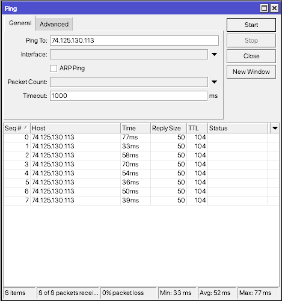
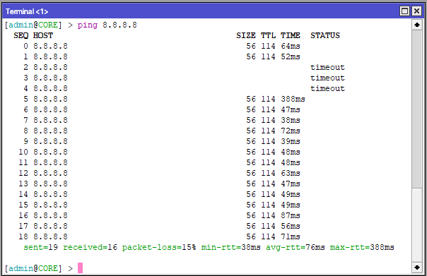
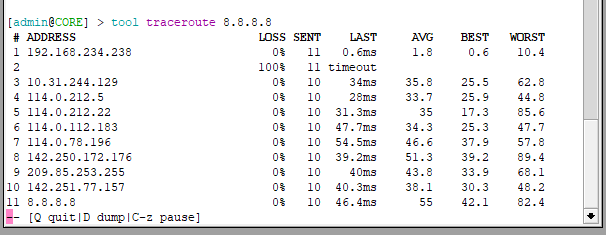
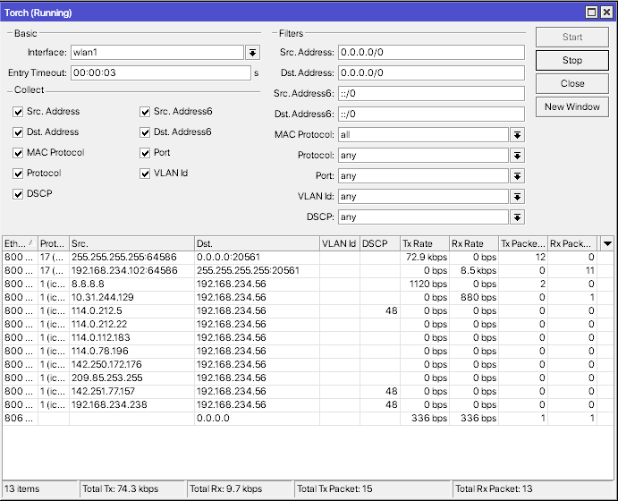
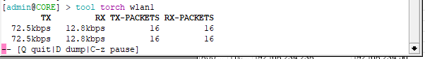
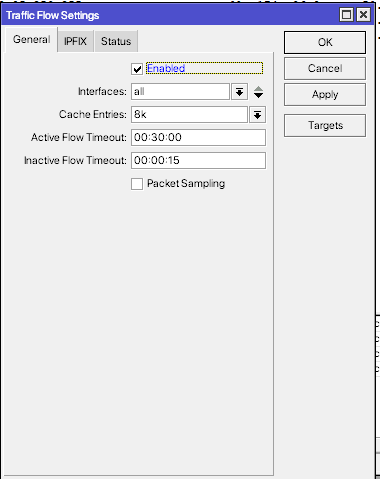
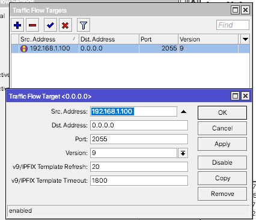
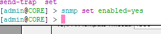

# LAB-42-Monitoring-Tools
Sabtu 23 Agustus 2025  
  
# Monitoring Tools Mikrotik
  RouterOS menyediakan berbagai monitoring tools yang memungkinkan admin jaringan untuk melakukan pengawasan secara real time maupun historis. Dengan adanya fitur ini, potensi masalah dapat terdetekdi lebih dini sehingga pemeliharaan jaringan menjadi lebih efisien.  
  
# Ping / ICMP  
  Ping digunakan untuk menguji konektivitas antar perangkat dalam jaringan dengan mengirimkan paket ICMP. Ping dapat membantu mengetahui apakah suatu host dapat dijangkau dan berapa lama waktu responnya.  
  Kita bisa lakukan ping mengunakan CLI maupun GUI.  
     Menggunakan GUI di **tool > ping**  
       
     Menggunakan CLI  
       
    Ping to, alamat IP/host tujuan.  
    Interface, jalur interface yang akan digunakan untuk mengirim ping.  
    ARP Ping, Jika dicentang, router akan mengirim paket ARP.
    Packet Count, Jumlah paket ping yang akan dikirim. Jika dikosongkan, ping akan berjalan terus.
    Timeout, Waktu maksimal router menunggu balasan.  
      
# Traceroute
  Digunakan untuk menelusuri jalur yang dilewati paket menuju host tujuan.  
  Kita bisa lakukan traceroute di GUI maupun CLI.  
      Mengunakan GUI di **tool > traceroute**  
       
      Mengunakan CLI  
       
     Traceroute ini menunjukkan jalur internet dari router menuju Google DNS (8.8.8.8) dengan latency rata-rata 45 ms, semua hop terbaca dengan baik kecuali ada satu yang tidak merespons.  
       
# Torch  
  Merupakan alat pemantau lalu lintas secara real time. Tool ini dapat menampilkan sumber IP, tujuan IP serta bandwidth yang digunakan.  
       
     Versi CLI,  
       
  Torch membantu admin melihat siapa yang mengirim/ menerima data, ke mana arah paket, dan seberapa besar bandwidth yang digunakan secara langsung.  
    
# Bandwidth Test
  Digunakan untuk menguji kecepatan koneksi antar dua perangkat Mikrotik. Tol ini penting untuk memastikan apakah kapasitas bandwidth sesuaid engan kontrak ISP atau kebutuhan internal.  
       
       

# Traffic Flow
  Fitur monitoring berbasis protokol NetFlow. Dengan ini, alitar trafik dapat dikirim ke server collector untuk analisis lebih mendalam.  
  1. Masuk ke **IP > Traffic Flow**, klik Enable untuk mengaktifkan.
       
  2. Lalu klik/masuk ke **target** dan add.  
       
  Di sini, router akan mengirim data ke server collector dengan alamat IP 192.168.1.100.  

# SNMP (Simple Network Management Protocol)  
  Memungkinkan pengawasan router melalui aplikasi eksternal seperti Cacti atau Zabbix. Data yang dikirim mencakup CPU load, penggunaan memori hingga trafik interface.  
  Pergi ke terminal dan ketik *snmp set enabled=yes*
       
  Setelah diaktifkan, router dapat dipantau menggunakan aplikasi SNMP manager.  

# Kesimpulan
  Monitoring tools pada Mikrotik memiliki peran yang sangat penting dalam menjaga kinerja, stabilitas, dan keamanan jaringan. Setiap alat yang tersedia memiliki fungsi spesifik.
